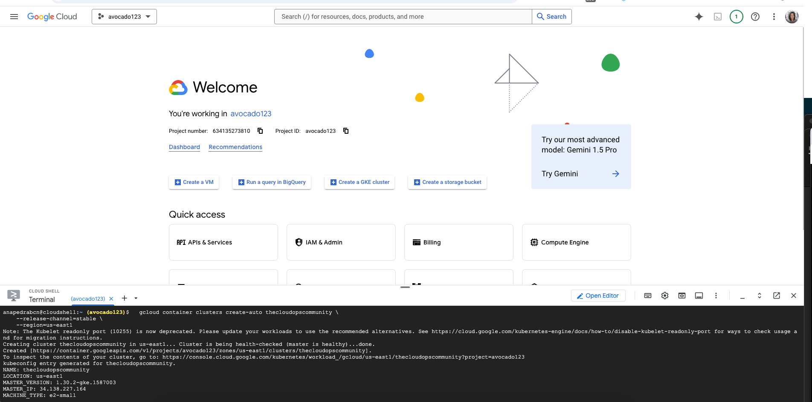

This is the architecture we will follow:

We will use GCP to provision the Kubernetes cluster and the commands in the readme:

we do kubectl get nodes to see the cluster is ready:

we deploy Prometheus and Grafana with helm following the commands from the readme:

We do first portforwarding to access Prometheus:

After, instead of doing port forwarding we will change the service type top load balancer to access easier:

In Grafana we put Prometheus as data source adn put the Prometheus server URL with the address from the Prometheus we got before

We will trigger a notification with Slack using the slack api, create an App, from scratch. We activate Incoming Webhooks, we choose a channel and create a secret for the alert manager with the webhook url.

We apply the prometheus alertmanagerconfig.yaml and scale down deployment contacts:

Now contacts is unavailable and an alert is fired in slack:

To revert it we scale up to 1 replica:

